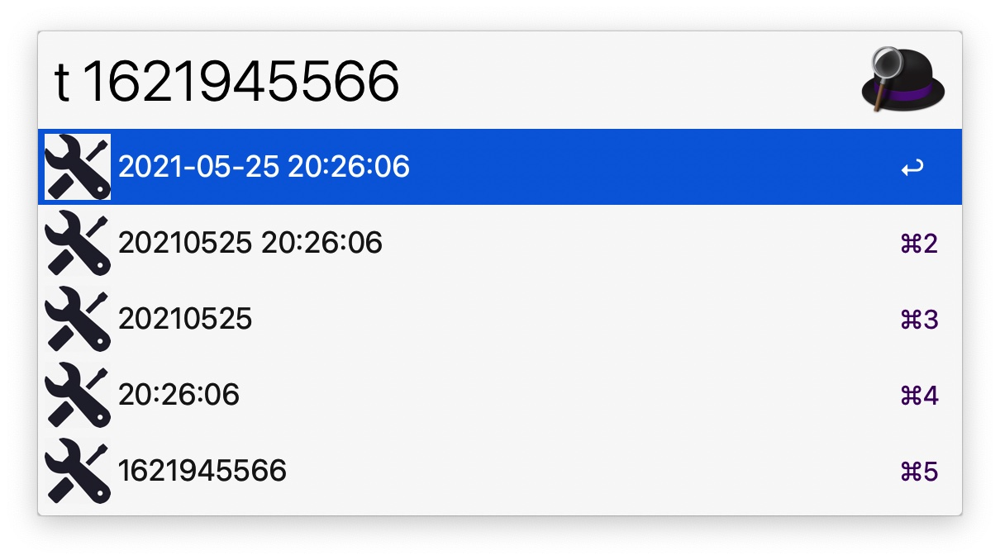
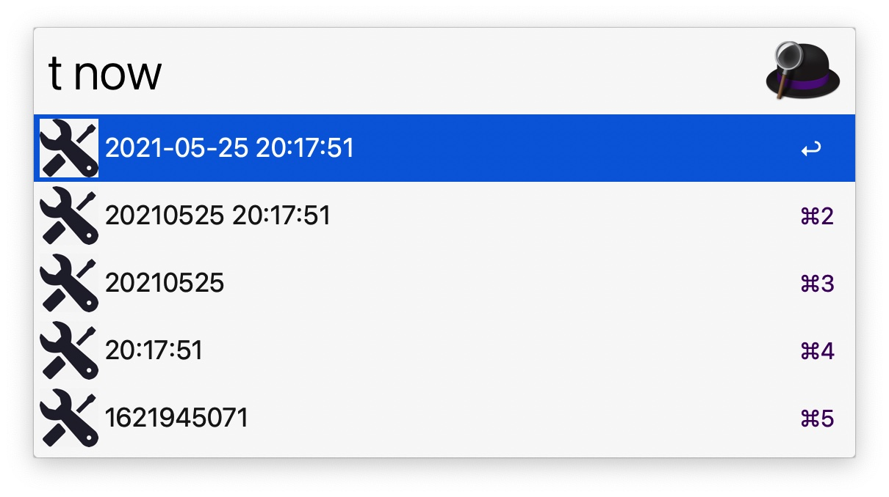
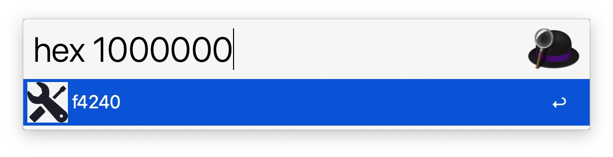
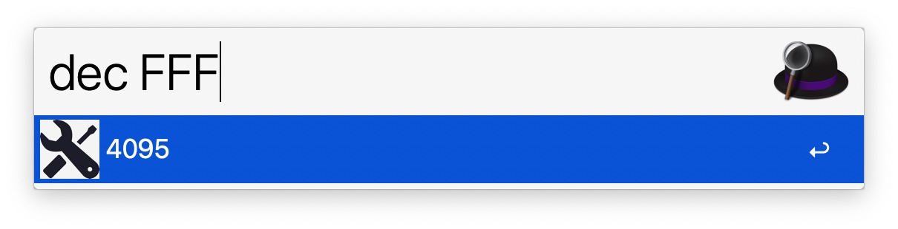
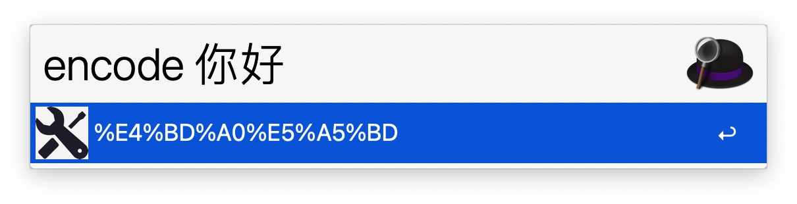
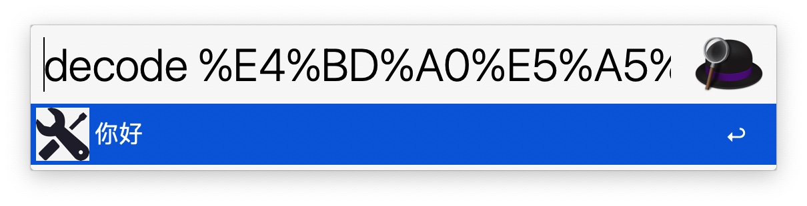

# 个人用的插件
1. YoudaoTranslate

    有道词典翻译，详见： https://github.com/wensonsmith/YoudaoTranslate

2. Terminal Finder

    终端和finder互跳。

3. Tools

    自己写的插件，包含时间戳转换、进制转换、编码转换等。
    Some useful tools, include time conversion, hexadecimal conversion, string codec, and so on.
    
    1. 时间戳转换
    
    
    > 注意，该插件本质用的是/usr/local/bin/gdate，如果没有该命令，需要安装，命令：`brew install coreutils`

    2. 进制转换
    
    

    3. 编码转换
    
    

4. Search Xmind

    Search keyword in multi xmind files
